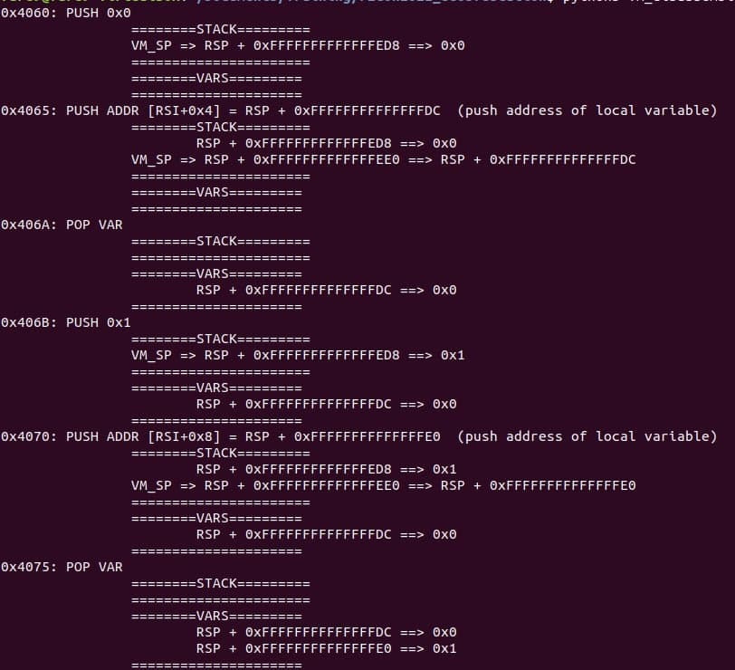
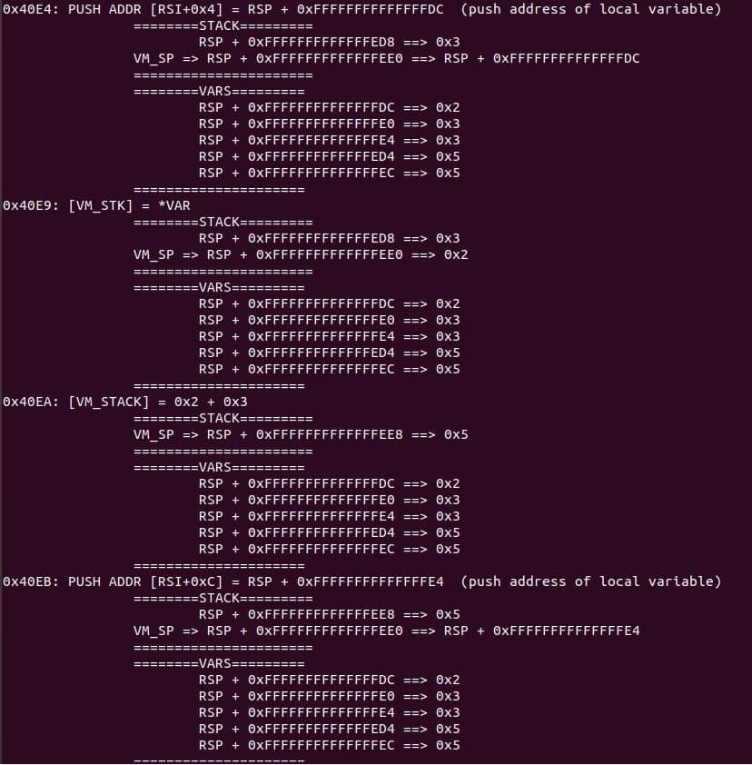

# vm_disassembler_tracer.py

This script takes the values obtained from *miasm* while applying symbolic execution, to follow the control flow of the program and generating a *VM Stack* and *local variables* used during the execution of the binary.

This will be helpful to follow the execution of the obfuscated function, as the obfuscation works with a virtual stack, and virtual variables, we cannot easily watch this on a debugger, this tracer allows you to follow the execution watching after each instruction the result on stack and in variables.

* Example 1:

* Example 2:

## Execution output

You can see one of the outputs using as input parameter the value *5*, in the file *output.txt*.